# CSCE 435 Group project

## 0. Group number: 21

## 1. Group members:
1. Sathvik Yeruva
2. Ishaan Nigam
3. Yusa Sagli
4. Mustafa Tekin
   
Note: We will communicate through imessage on our phones  
## 2. Project topic (e.g., parallel sorting algorithms)

### 2a. Brief project description (what algorithms will you be comparing and on what architectures)

Bitonic Sort(Ishaan):This is a comparison-based sorting algorithm that is well-suited for parallel computing. It works by recursively sorting a sequence into a
bitonic sequence and then merging it.This algorithm is ment to be highly efficient on parallel architectures due to its regular structure.

Bitonic Sort Implementation Updates and Questions(Ishaan):
- Implementing the parallel Bitonic Sort algorithm has been challenging, particularly in ensuring that data is correctly sorted across all processes.
- Can you verify if my implementation is correct?
- Implementation Description: In my implementation of the parallel bitonic sort algorithm, the input data is divided among multiple processes, each performing a local bitonic sort. At each stage, processes exchange data with a partner (determined by XORing their rank with a mask) and perform compare-exchange operations, retaining smaller or larger elements depending on the sorting direction. I used recursive merging to ensure local data is sorted before communication between processes. Once all stages are complete, the root process gathers the globally sorted data using MPI_Gather.
    
Sample Sort(Mustafa):This is a divide-and-conquer sorting algorithm that is well-suited for parallel computation. This algorithm wokrs by picking a set of sample from the input using it to partition the data into smaller buckets and sorting each bucket individually. Sample sort is designed in such a way to minimize inter-process communication, making it highly scalable.
  
Merge Sort(Sathvik): Merge Sort is a divide-and-conquer sorting algorithm that functions by recursively splitting the data set into smaller sublists, sorts them and then merges them together to create a fully sorted list. Merge Sort can use parallel architectures highly efficiently as the portions of data that the original data set is broken can be distributed across several processors which would allow for simultaneous sorting and merging of the sublists.
  
Radix Sort(Yusa): Radix Sort is a non-comparison-based sorting algorithm. It works by sorting numbers digit by digit, starting from the least significant digit to the most significant one. It's especially efficient for parallel computing because each digit can be sorted independently using counting sort or a similar linear-time algorithm. In this project, Radix Sort will be implemented and parallelized using MPI.

Architectures and Tools:
- Architecture: Distributed-memory systems using MPI on the Grace supercomputing platform.
- Parallelization Strategies: Implementing both master/worker and SPMD models.
- Performance Measurement: Using Caliper for performance instrumentation and Thicket for analysis.
  

### 2b. Pseudocode for each parallel algorithm
- For MPI programs, include MPI calls you will use to coordinate between processes

Bitonic Sort (Ishaan- UPDATED):

```text
#### Bitonic Sort (Ishaan- UPDATED):

Initialize MPI environment
    - MPI_Init to set up parallel processing
    - Determine rank (process ID) and size (number of processes)

Generate and distribute data:
    - Rank 0 generates the global data (random, sorted, reverse, or nearly sorted)
    - Scatter data to all processes using MPI_Scatter

Perform local bitonic sort on the local data:
    - Recursively sort local data into a bitonic sequence
    - Use compare-exchange operations to merge sequences

for k = 0 to log2(size) - 1 do // Stages
    for j = k down to 0 do     // Steps within stages
        mask = 1 << j
        partner = rank XOR mask

        Determine sorting direction:
            if ((rank >> (k + 1)) & 1) == 0 then
                dir = ASCENDING
            else
                dir = DESCENDING
            end if

        Exchange data with partner:
            - Use MPI_Sendrecv to exchange local data with the partner process

        Perform compare-exchange with received data:
            if rank < partner then
                if dir == ASCENDING then
                    Compare and keep lower elements in the local array
                else
                    Compare and keep higher elements in the local array
                end if
            else
                if dir == ASCENDING then
                    Compare and keep higher elements in the local array
                else
                    Compare and keep lower elements in the local array
                end if
            end if

    end for
end for

Synchronize all processes using MPI_Barrier

Gather sorted data at the root process using MPI_Gather

Print execution time at root

Finalize MPI environment using MPI_Finalize


```
Sample Sort (Mustafa):

```text
#### Sample Sort (Mustafa - UPDATED):

    Initialize MPI environment
Determine rank (process ID) and size (number of processes)
Generate local portion of data

if rank == 0 then
    Collect samples from all processes:
        for each process i > 0:
            Receive local samples using MPI_Recv from process i
    Sort the collected samples
else
    Send local samples to root using MPI_Send

if rank == 0 then
    Broadcast sorted samples to all processes using MPI_Send:
        for each process i > 0:
            Send sorted samples to process i
else
    Receive sorted samples from root using MPI_Recv

if rank == 0 then
    Choose splitters from sorted samples
    Broadcast(Communicate) splitters to all processes using MPI_Send:
        for each process i > 0:
            Send splitters to process i
else
    Receive splitters from root using MPI_Recv


Partition local data into buckets based on splitters

Exchange buckets between processes using MPI_Send and MPI_Recv:
    for each process i:
        Send relevant bucket to process i using MPI_Send
        Receive bucket from process i using MPI_Recv


Perform local sort on the received bucket


Gather sorted buckets at the root using MPI_Send and MPI_Recv:
    if rank == 0:
        for each process i > 0:
            Receive sorted bucket from process i using MPI_Recv
        Merge the sorted buckets into the final sorted array
    else
        Send sorted bucket to root using MPI_Send

Finalize MPI environment

```

Merge Sort(Sathvik - UPDATED):
```text
#### Merge Sort(Sathvik - UPDATED):
    Initialize MPI environment
    Determine rank (process ID) and size (number of processes)

    If rank == 0:
        Generate/Read Full Data Set based on input_type
        Divide the data set into equal chunks
        Distribute chunks to all processors including itself with MPI_Scatterv
        Print a sample of the initial data
    Else:
        Receive chunk of data using MPI_Scatterv

    Perform local sort on received data (e.g., Quicksort)

    active = True
    step = 1
    While step < size:
        If active:
            If rank % (2 * step) == 0:
                If rank + step < size then:
                    Exchange sizes with processor(rank + step) using MPI_Sendrecv
                    Receive sorted data from processor(rank + step) with MPI_Recv
                    Merge this data with local data to make a larger sorted list
            Else if rank % (2 * step) == step:
                Send size to processor(rank - step) using MPI_Sendrecv
                Send sorted local data to processor(rank - step) with MPI_Send
                active = False  // Process becomes inactive but stays in the loop
        Synchronize all processes with MPI_Barrier
        step = step * 2

    If rank == 0:
        Verify that data is correctly sorted
        Output or store the fully sorted data in local data
        Print a sample of the sorted data

    Finalize MPI environment
```

Radix Sort (Yusa - Updated):

```text
#### Radix Sort (Yusa):

    Initialize MPI environment
Determine rank (process ID) and size (number of processes)

If rank == 0 then
    Generate/Read full data set 'data' based on 'input_type'
Else
    data remains uninitialized (NULL)

Ensure total number of elements 'n' is divisible by 'size'
If not divisible then
    If rank == 0 then
        Output error message: "Array size must be divisible by number of processes."
    Finalize MPI environment
    Exit program

Calculate local number of elements 'local_n' as 'n / size'
Allocate memory for 'local_data' with size 'local_n'

If rank == 0 then
    // Data Initialization Region (Caliper annotated as 'data_init_runtime')
    Initialize 'data' based on 'input_type' (e.g., random, sorted, reverse)

Distribute data to all processes using MPI_Scatter:
    Each process receives 'local_n' elements into 'local_data' from 'data'

Compute local maximum value 'local_max' from 'local_data'

Compute global maximum value 'global_max' using MPI_Allreduce with MPI_MAX on 'local_max'

Synchronize all processes using MPI_Barrier
Record 'start_time' using MPI_Wtime()

for each digit position 'exp' (starting from 1, while 'global_max / exp > 0') do:

    Perform local counting sort on 'local_data' based on current digit 'exp'

    Gather all sorted subarrays at root process using MPI_Gather:
        Root process collects sorted 'local_data' from all processes into 'gathered_data'

    If rank == 0 then
        Perform counting sort on 'gathered_data' based on current digit 'exp'

    Scatter the globally sorted data back to all processes using MPI_Scatter:
        Each process updates 'local_data' with its portion of 'gathered_data'

    If rank == 0 then
        Free memory allocated for 'gathered_data'

end for

Synchronize all processes using MPI_Barrier
Record 'end_time' using MPI_Wtime()

Gather final sorted data at root process using MPI_Gather:
    Root process collects 'local_data' from all processes into 'data'

If rank == 0 then
    Output total time taken: 'end_time - start_time'
    Optionally, verify correctness of 'data'
    Free memory allocated for 'data'

Free memory allocated for 'local_data'

Finalize MPI environment

```

### 2c. Evaluation plan - what and how will you measure and compare
- Input sizes, Input types
- Strong scaling (same problem size, increase number of processors/nodes)
- Weak scaling (increase problem size, increase number of processors)

Metrics to Measure:
- Execution Time: Total time taken by each algorithm to sort the data.
- Speedup: How much faster the parallel algorithm is compared to the sequential version.
- Efficiency: Ratio of speedup to the number of processors.
- Scalability: How performance changes with varying numbers of processors (strong and weak scaling).
- Communication Overhead: Time spent in communication between processors.
  
Input Sizes:
- 1024, 2048, 4096, 8192, 16384
  
Input Types:
- Sorted: Data already in order.
- Sorted with 1% Perturbed: Nearly sorted data with minor perturbations.
- Random: Data in random order.
- Reverse Sorted: Data sorted in reverse order.

Scaling Experiments:

   1.) Strong Scaling: 
      - Keeping the problem size constant while increasing the number of processors.By doing this we can observe how the execution time decreases as more      
        processors are added.
      - Plan:Choose a fixed large dataset.Run each algorithm on varying numbers of processors (e.g., 2, 4, 8, 16, 32).Record execution times and calculate speedup          and efficiency.
   
   2.) Weak Scaling:
      - Increasing problem size while also increasing the number of processors. The problem size proportion should remain constant with for the number of
      processors (proportional).
      - Plan: Each processor should have 1000 values to sort through, so 2 processors would have 512 values while 32 processors
      would have 16384 values to sort. Keeping the problem size proportially constant to the number of processes.


Bitonic Sort (Ishaan) Call Tree:
 
```text 
 
Path                 Min time/rank Max time/rank Avg time/rank Time %     
main                      0.000080      0.000098      0.000089  0.677316  
  comm                    0.000024      0.000026      0.000025  0.188056  
    comm_large            0.000029      0.000038      0.000033  0.254078  
      MPI_Scatter         0.003863      0.004273      0.004068 30.995997  
      MPI_Gather          0.001040      0.001048      0.001044  7.955633  
  data_init_runtime       0.000039      0.000039      0.000039  0.149396  
  MPI_Barrier             0.002429      0.002772      0.002600 19.812123  
  comp                    0.000015      0.000016      0.000015  0.116183  
    comp_large            0.000204      0.000227      0.000215  1.641660  
  mpi_bitonic_sort        0.000023      0.000025      0.000024  0.180948  
    comm                  0.000013      0.000014      0.000013  0.100293  
      comm_large          0.000018      0.000021      0.000020  0.150093  
        MPI_Sendrecv      0.001326      0.001389      0.001357 10.342060  
    comp_small            0.000011      0.000011      0.000011  0.085211  
  MPI_Comm_dup            0.003230      0.003265      0.003247 24.741450  

```

### Performance Evaluation

#### 1. Bitonic Sort (Ishaan)

**Graphs:**  

- **Main:**
  
  - Strong Scaling Plots for Each Input Size:    
    
    
    
    
    
    
     .
    
  - Strong Scaling Speedup Plots
    
    
    
      .
    
  - Weak Scaling Plots (Combined on One Graph)
      .
    

- **Comm:**
  
  - Strong Scaling Plots for Each Input Size
    
    
    
    
    
    
      .
    
  - Strong Scaling Speedup Plots
    
    
    
     .
      
  - Weak Scaling Plots (Combined on One Graph)
      .


- **Comm_Large:**
  
  - Strong Scaling Plots for Each Input Size
    
    
    
    
    
    
      .
    
  - Strong Scaling Speedup Plots
    
    
    
       .
    
  - Weak Scaling Plots (Combined on One Graph)
      .


#### 2. Analysis of Results - Bitonic Sort (Ishaan)

1. Strong Scaling Analysis   

Large array sizes scale well: In the strong scaling plots, particularly for larger arrays like 67108864 and 268435456, the implementation demonstrates good scaling. Larger problem sizes allow for more efficient distribution of computation across processors, reducing the relative impact of communication overhead. With sufficient work per processor, the processors can focus more on sorting rather than communicating, resulting in improved speedup as more processors are added.

Small array sizes suffer from communication overhead: This is evident in the strong scaling plots, where communication costs dominate the runtime for small inputs, particularly with reverse and random input types. The relative cost of communication is too high in comparison to the computation time, which restricts scalability. For small arrays, the communication required between processors may overwhelm the benefits of parallel processing.

Input type matters: The algorithm performs best on sorted and nearly sorted inputs, which consistently show better strong scaling. For ordered data, fewer comparisons and exchanges are required, minimizing inter-processor communication. However, reverse and random inputs result in more frequent data exchanges, increasing communication overhead and limiting scalability.


2. Weak Scaling Analysis  

Ideally in the weak scaling plot, the average time per rank should remain relatively constant as more processors are added. In analyzing my plots however, I observe that the average time per rank increases with the number of processors, especially for the random input type. This tells me my algorithm is facing some overhead as more processors are added. I hypothesize that for random input types, there is higher communication and synchronization costs in the implementation. This input requires more data exchanges and sorting operations between processors, impacting the average time per processor to increase.  

3. Communication Overhead
    
Across both strong and weak scaling plots, communication overhead is the main limiting factor, especially for random input types. For the random input type, the MPI_Sendrecv calls increase substantially as processors exchange data and merge sorted subarrays, causing communication to dominate the runtime. This impact is especially pronounced in scenarios where data is highly disordered.

Sorted and nearly sorted inputs require fewer data exchanges, leading to better performance and scalability. The bitonic sort algorithm works more efficiently when the data is already partially ordered, as this reduces the communication needed to reach the final sorted state.

4. Speedup Analysis

An outlier was observed for the smallest array size, reaching an unrealistically high speedup of around 6000. This anomaly likely stems from measurement issues, where the timing overhead affects the results more than actual computation gains. For small datasets, measurement artifacts can inflate speedup values, so this data point can be considered an outlier and not a true representation of the algorithm’s performance.

For larger array sizes, the speedup grows at a slower rate. This tells me that as the data size increases, the communication overhead and the time for data transfer between processors start to outweigh the benefits of parallelization. For the largest array sizes, the speedup curve almost plateaus, indicating that adding more processors does not significantly improve performance. This also indicates that the overhead of managing inter-processor communication and data movement starts to dominate.


#### 1. Merge Sort (Sathvik)

**Example Graph:** 

- **Main:**
  
  - Strong Scaling Plots for Each Input Size:    
    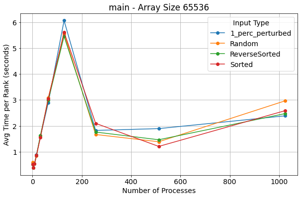
    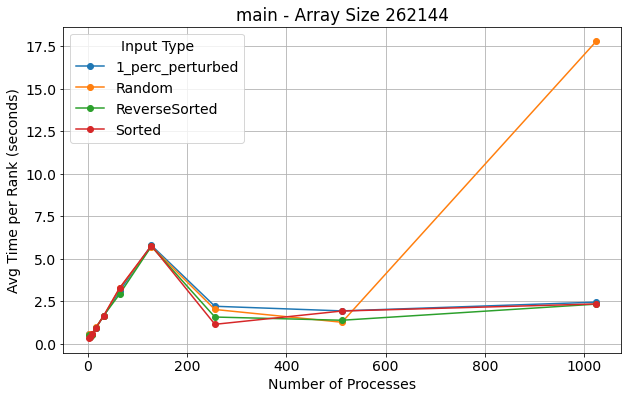
    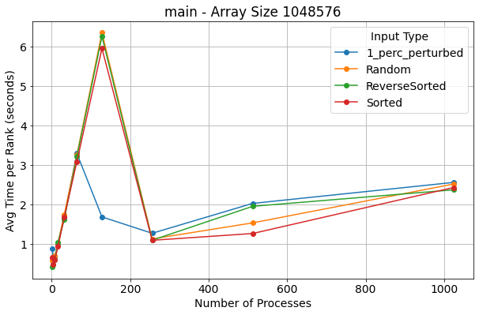
    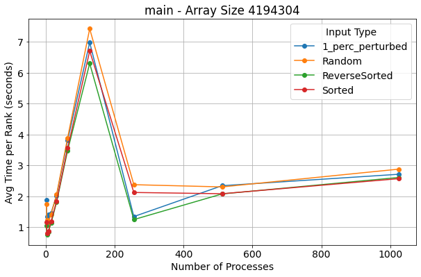
    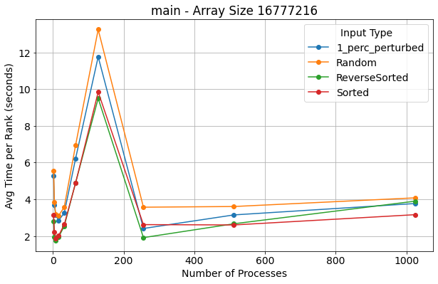
    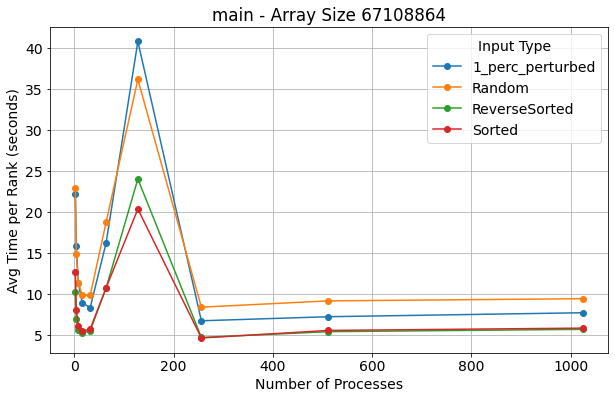
    

  - Strong Scaling Speedup Plots
    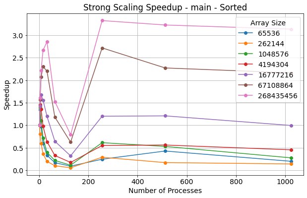
    
    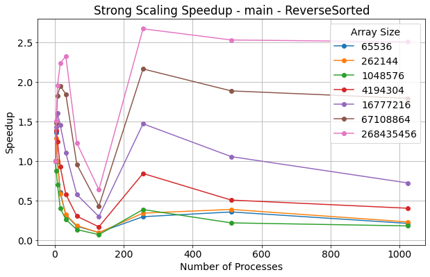
    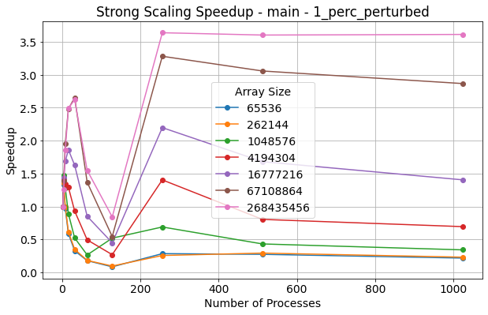

  - Weak Scaling Plots (Combined on One Graph)
    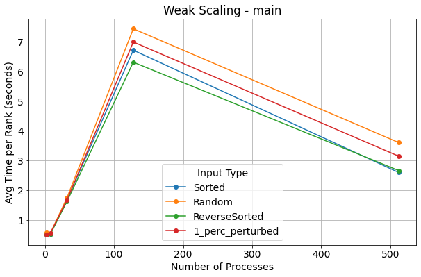
    

- **Comm:**
  
  - Strong Scaling Plots for Each Input Size
    
    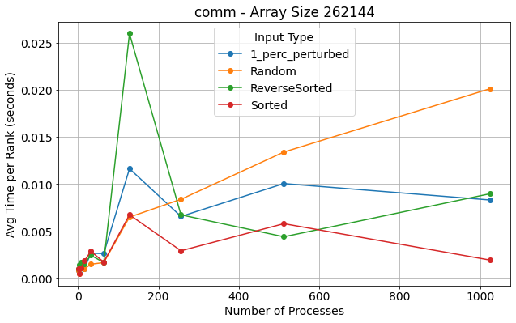
    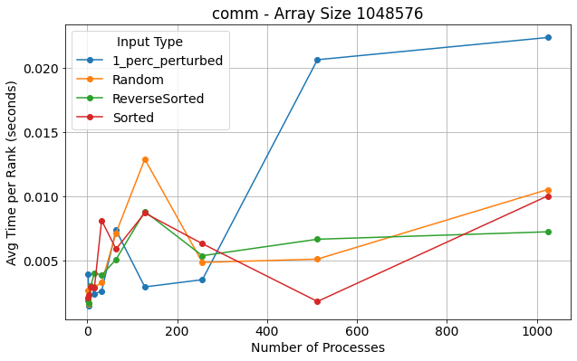
    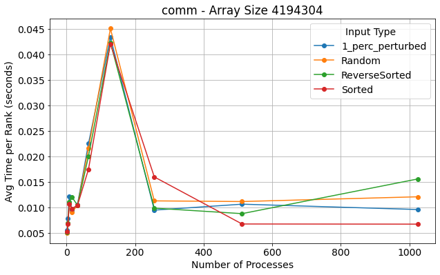
    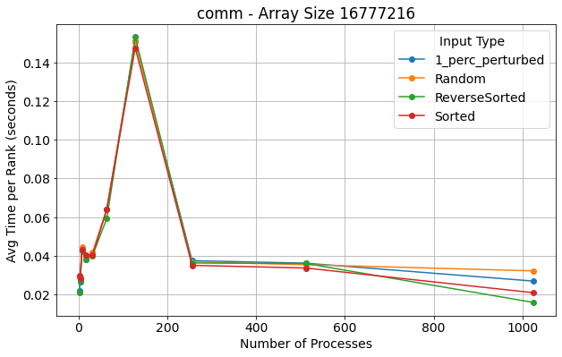
    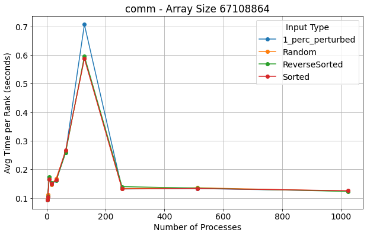
    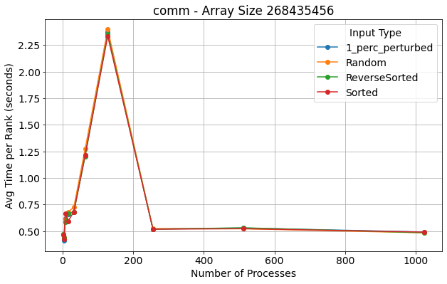
    
  - Strong Scaling Speedup Plots
    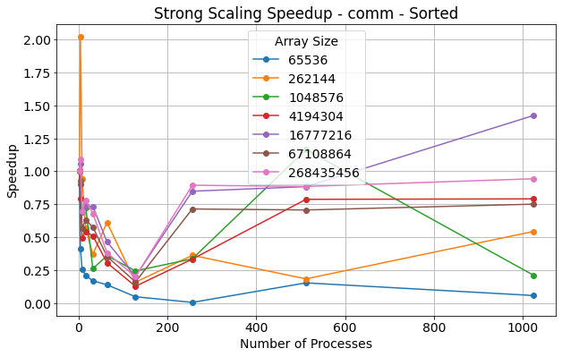
    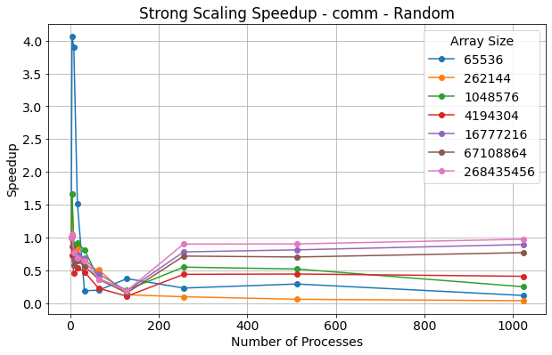
    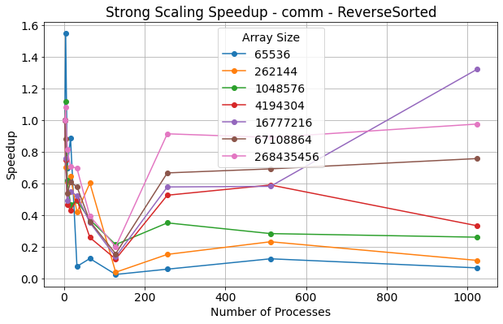
    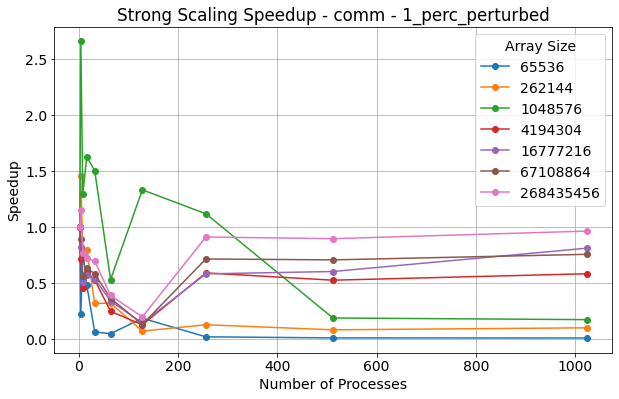
      
  - Weak Scaling Plots (Combined on One Graph)
    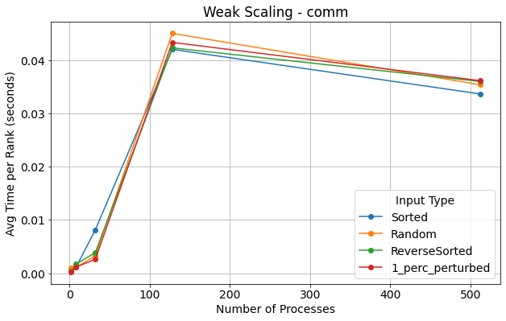
    


- **Comm_Large:**
  
  - Strong Scaling Plots for Each Input Size
    
    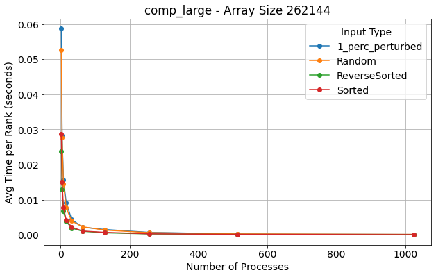
    
    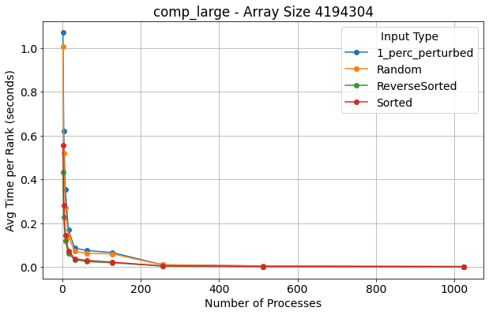
    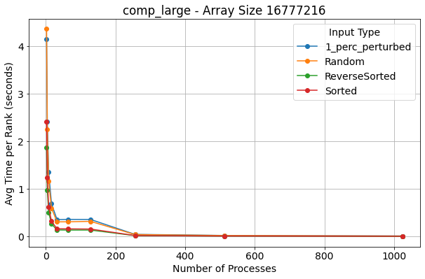
    
    
    
  - Strong Scaling Speedup Plots
    
    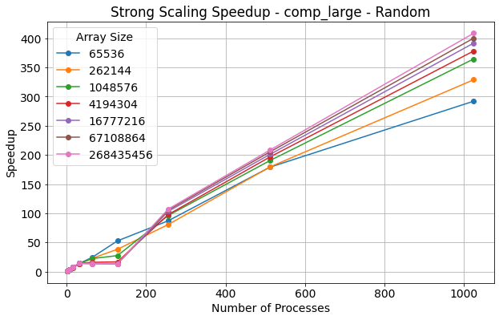
    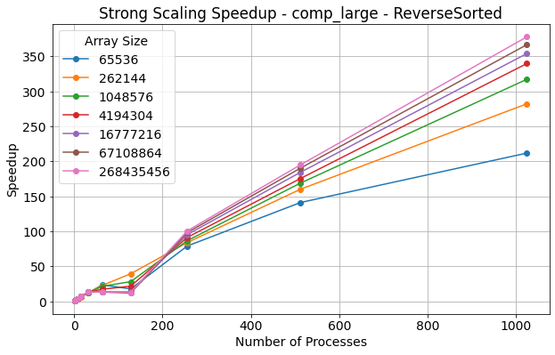
    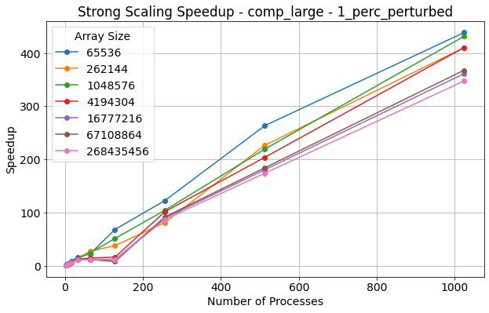

  - Weak Scaling Plots (Combined on One Graph)
    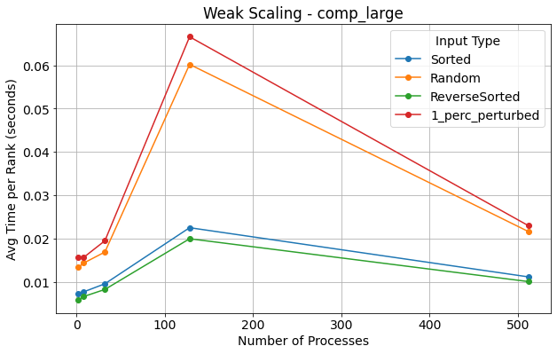


#### 2. Analysis of Results

1. Strong Scaling Analysis 
The algorithm that I have written, Merge Sort, shows good and clear scalability for the runs with larger array sizes such as the ones with 2^26 and 2^28 elements where this increasing in processing decreases the overall execution time. The improvement in the time for execution stems from the algorithm having each processor handling the proper amount of data while also hosting an efficient merging process. On the other hand, with smaller sized arrays, the impact of the scaling isn't as noticeable as the lower amount of elements means that each processor's workload is too low to bring more computational gain than there is overhead from the communication. Essentially this means a lowered amount of performance improvenemnt for these arrays.

2. Weak Scaling Analysis
For this merge sort algorithm, whenever both the problem size and the input size increases proportionally, the algorithm performs very well on large sets of input. In these cases the execution times have stayed stable as the overall workload is evenly distributed creating a balanced performance. Based on the data, the merged data seems to be scaling somewhat logarithmically as it maintains efficient communication even with increased processors. Although, it is noticeable that there could be variances in the time based on the differences in local sorting times for highly varied data, but overall, weak scaling is still good.

3. Communication Overhead
In a parallel merge sort algorithm, the communication overhead exists within the distribution of the data amongst all of the processors as well as the merging of the subarrays. This overhead has a much more significant impact upon smaller inputs as the work that is split up amongst the processors isn't enought to outweigh this overhead by a lot. On the otherhand, with inputs that are much larger, the overhead becomes a welcome cost as the speedup caused by the distributed it work causes the sorting to occur much more quickly. In addition, in the algorithm, the use of Scatterv ensures that the distribution of the data as well as the communication during merging will be efficient.

One key item that I noticed is that the runs that I had done with the 128 processors seemed to have taken signifiantly more time than any of the other runs and I think this could be due to a variety of outside factors such as the workload of grace or just outliers in the data, but it doesn't seem to be representative of the algorithm.


#### 1. Sample Sort (Mustafa)

**Graphs:** 

Main (Strong Scaling):


Comm (Strong Scaling):


Comp (Strong Scaling):


#### 2. Analysis of Results

Main:

Trend: All input types show a similar decreasing trend in the average time per rank as the number of processes increases.
Observations: The time per rank decreases sharply from 2 to 128 processes, indicating efficient load distribution and parallelization benefits. After about 128 processes, the time per rank flattens, showing diminishing returns with higher process counts.
Reasoning: The overhead of communication and coordination among more processes outweighs the benefits of further parallelization beyond a certain point, typical in parallel algorithms.

Comm:

Trend: For all inputs, the average time initially decreases as the number of processes increases, reaching a minimum around 128 to 256 processes. Beyond this point, time per rank begins to increase slightly.
Observations: This trend suggests that communication overhead in the MPI sample sort starts to dominate as the process count grows. As processes increase, the amount of inter-process communication required in sample sorting may introduce latency, especially in larger clusters.
Insight: The increase in time at higher process counts highlights the balance needed between computation and communication. Efficient sorting relies on optimal process count to minimize communication costs in MPI-based algorithms.

Comp:

Trend: The computation time decreases significantly with an increase in processes across all input types. This is consistent with the main trend, where parallelization reduces computation time effectively up to about 512 processes.
Observations: This graph shows that the computational workload is well distributed across processes. However, the rate of decrease slows down after a certain point, indicating again the diminishing returns of adding more processes.
Conclusion: The comp graph confirms that the algorithm scales well in terms of computation but suffers from increasing overhead at higher process counts.
Comparative Input Analysis
Random vs. Sorted vs. Perturbed vs. Reverse:
Across all graphs, the Sorted and Random inputs generally perform slightly better than Reverse and Perturbed. This pattern implies that the MPI sample sort algorithm is somewhat sensitive to the initial ordering of data, with less disorder in the input leading to faster performance.
For each input type, the differences are minimal at lower process counts but become slightly more apparent as process counts increase, especially in the "comm" graph where communication overhead plays a more significant role.

Overall:
The MPI sample sort algorithm shows good scalability with increasing processes, but performance gains diminish due to communication overhead, particularly at higher process counts (beyond 256 or 512). Sorted and Random inputs generally lead to slightly faster results, indicating that input order influences performance, although not drastically. The optimal number of processes seems to be around 128 to 256, balancing computation and communication efficiently.


#### 1. Radix Sort (Yusa)

**Graphs:** 

Main Random (Strong Scaling):


Main Sorted (Strong Scaling):


Main Reverse (Strong Scaling):


Comp input size 6553 (Strong Scaling):


Comp input size 262144 (Strong Scaling):


Comp input size 1048576 (Strong Scaling):


Comp input size 4194304 (Strong Scaling):


Comp input size 16777216 (Strong Scaling):


Comp input size 67108864 (Strong Scaling):


Comp input size 268435456 (Strong Scaling):


Speedup Random (Main)


Speedup Sorted (Main)


Speedup Reverse (Main)


Speedup Perturbed 1% (Main)


Speedup Random (Communication)


Speedup Sorted (Communication)


Speedup Reverse (Communication)


Speedup Perturbed 1% (Communication)


Speedup Random (Comp)


Speedup Sorted (Comp)


Speedup Reverse (Comp)


Speedup Perturbed 1% (Comp)


Main Random (Weak Scaling)


Main Sorted (Weak Scaling)


Main Reverse (Weak Scaling)


Main Perturbed 1% (Weak Scaling)


Communication Random (Weak Scaling)


Communication Sorted (Weak Scaling)


Communication Reverse (Weak Scaling)


Communication Perturbed 1% (Weak Scaling)


#### 2. Analysis of Results Radix Sort


1. Strong Scaling Analysis:

Large input sizes scale well: The parallel Radix Sort implementation demonstrates effective strong scaling for larger input sizes, such as 2^24 2^24 and 2^28 2^28
  elements. As the number of processors increases, the average time per rank decreases significantly for these large datasets. This indicates that the workload is being efficiently divided among processors, allowing for concurrent processing of different portions of the data. The algorithm benefits from the parallelization of digit-wise sorting steps, which are computationally intensive for large arrays.

Diminishing returns at higher processor counts: While the time per rank decreases with more processors, the rate of improvement slows down beyond a certain point, typically around 256 to 512 processors. This plateau suggests that communication overhead and synchronization costs start to offset the benefits of adding more processors. The fixed overheads in the algorithm, such as broadcasting the maximum number of digits and gathering sorted subarrays, become more prominent as the per-processor workload decreases.

Small input sizes suffer from overhead: For smaller input sizes like 
2^16, 2^16 and 2^18 2^18, the strong scaling plots show minimal improvement or even slight increases in time per rank with more processors. This is due to the overhead of initializing MPI processes and the relative cost of communication compared to computation. With less data per processor, the time spent on communication and synchronization constitutes a larger fraction of the total execution time, negating the benefits of parallelism.

Input type impact is minimal: Unlike comparison-based sorting algorithms, Radix Sort's performance is less sensitive to the initial ordering of data. The strong scaling plots for different input types—Random, Sorted, Reverse Sorted, and 1% Perturbed—are closely aligned. This consistency occurs because Radix Sort processes each digit position uniformly, regardless of the data distribution. Therefore, the algorithm exhibits similar performance characteristics across different input types in strong scaling scenarios.

2. Weak Scaling Analysis:

Stable performance with increasing problem size: In the weak scaling analysis, where both the problem size and the number of processors increase proportionally, the average time per rank remains relatively constant for larger datasets. This indicates that the algorithm scales efficiently, maintaining consistent performance as the workload per processor stays the same. The Radix Sort algorithm effectively handles larger datasets without significant degradation in per-processor performance.

Slight increase in time for higher processor counts: Although the average time per rank is relatively stable, there is a slight upward trend as the number of processors increases beyond 256. This increase is attributed to the cumulative communication overhead associated with more processors. Each additional processor introduces more points of synchronization and communication, slightly increasing the total execution time.

Uniform performance across input types: Similar to the strong scaling results, the weak scaling plots show minimal variation across different input types. The algorithm's digit-wise processing ensures that the input data's initial order does not significantly impact the computation or communication patterns. As a result, the average time per rank remains consistent across Random, Sorted, Reverse Sorted, and 1% Perturbed inputs in weak scaling experiments.

3. Communication Overhead:

Communication costs become significant at high processor counts: Communication overhead is a critical factor affecting the parallel Radix Sort's performance, especially as the number of processors increases. The algorithm involves multiple collective operations, such as broadcasts and gathers, during each digit's sorting phase. These operations require synchronization and data exchange among all processors, which can introduce latency.

Impact on small input sizes: For smaller arrays, the communication overhead can dominate the total execution time. Since each processor handles a smaller portion of the data, the relative cost of communication (e.g., broadcasting the maximum number of digits or gathering sorted subarrays) increases. This overhead leads to less efficient scaling and can result in longer execution times despite increasing the number of processors.

Efficient communication patterns for large inputs: In contrast, for larger input sizes, the communication overhead is amortized over a more substantial computational workload per processor. The time spent on communication constitutes a smaller percentage of the total execution time, allowing the algorithm to scale more effectively. The use of optimized MPI collective operations helps mitigate communication costs, but their impact becomes more pronounced with higher processor counts.

4. Input Type Effects:

Minimal influence of input ordering: The Radix Sort algorithm's performance is largely independent of the initial data ordering. Since the algorithm processes each digit position systematically, the distribution or order of the input data does not significantly affect the number of operations required. This behavior is reflected in the performance graphs, where all input types exhibit similar execution times across various processor counts.

Consistency across different datasets: The slight variations observed among different input types are negligible compared to those in comparison-based sorting algorithms. This consistency makes Radix Sort a robust choice for parallel sorting tasks where the input data characteristics are unknown or highly variable.

5. Overall Observations and Speedup Analysis:

Effective parallelization for large-scale sorting: The parallel Radix Sort implementation demonstrates good scalability for large input sizes, making it suitable for high-performance computing environments where massive datasets are common. The algorithm efficiently leverages multiple processors to reduce computation time, particularly when the per-processor workload is substantial enough to outweigh communication overheads.

Diminishing returns due to communication overhead: As the number of processors increases beyond a certain threshold, the benefits of adding more processors diminish. The communication and synchronization costs begin to dominate, leading to a plateau in performance improvements. Identifying the optimal number of processors is crucial to maximize efficiency and minimize unnecessary overhead.
